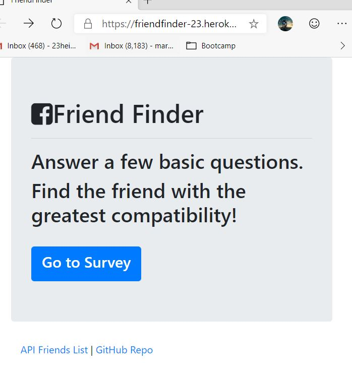
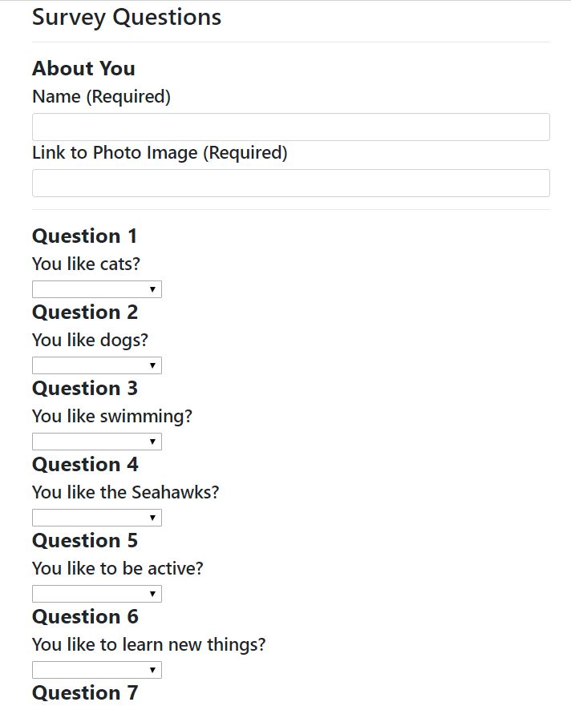
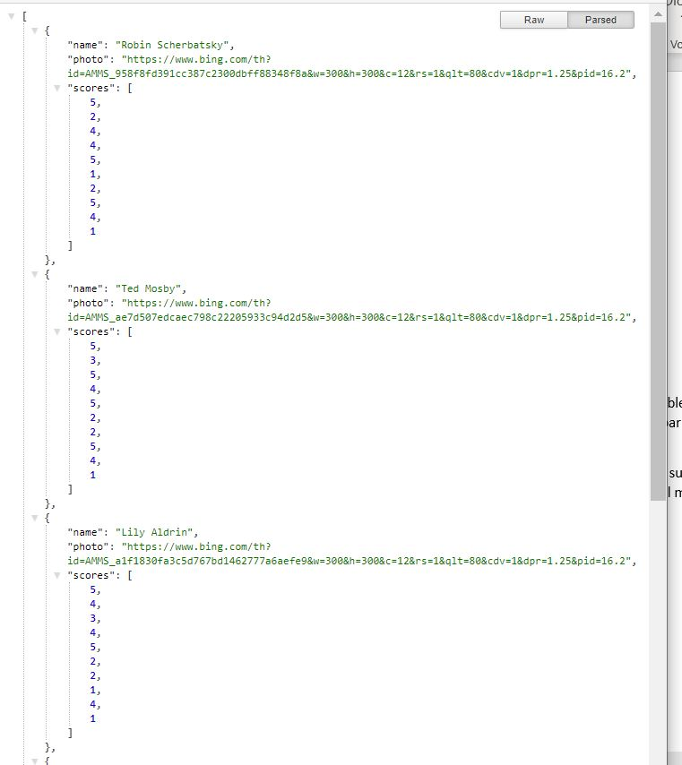
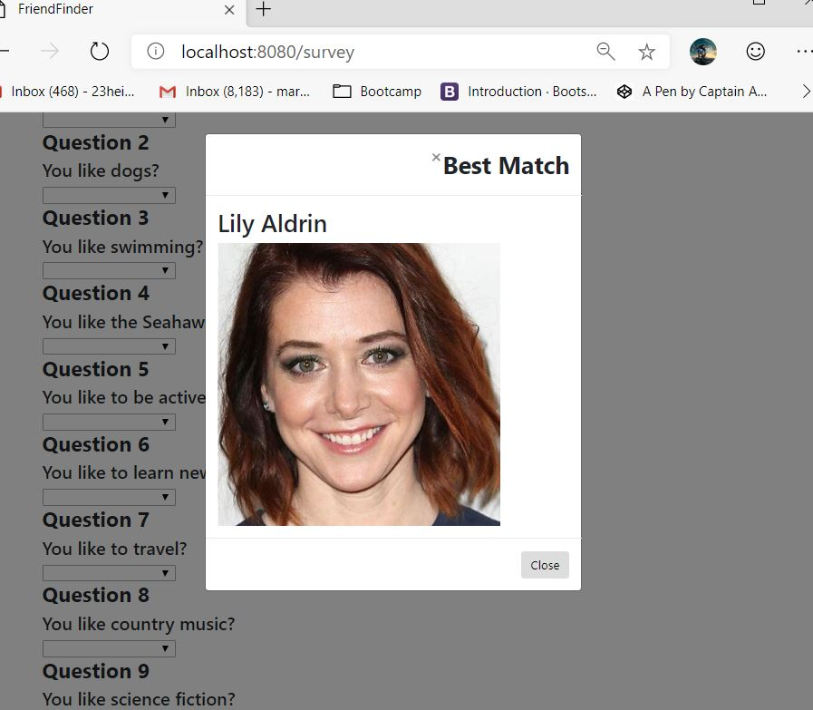

# FriendFinder

This App can be found at: https://friendfinder-23.herokuapp.com/
If running this app from Github, the following will need to be installed prior to execution:
•	NPM package
•	Express
•	Path
This app uses ten survey questions to determine the person with whom you’re most compatible.  The application compares your answers to the answers of the people in the database. After comparing the answers, the program identifies the best match.
This application has two screens. The home screen provides a button that takes the user to a survey page. In addition to the survey button, there are links that will take you to the list of potential matches and a link to the github repository.
I had a lot of fun building this app and hope that it brings you joy.

## Image 1 Friend Finder Home Page

## Image 2 Friend Finder Survey Page

## Image 3 Friend Finder API

## Image 4 Best Match

